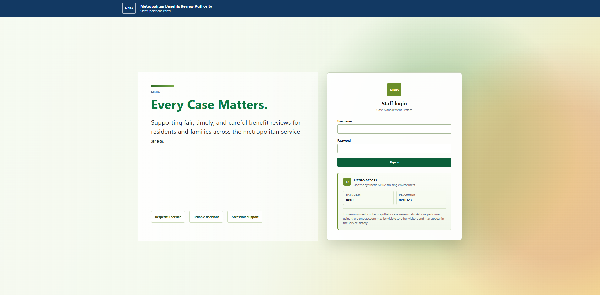

# CaseAxis

CaseAxis is a production-deployed enterprise case management platform that models the operational workflows found in government agencies, insurance carriers, regulatory bodies, and large service organizations.

The system handles high-volume casework through role-based access controls, auditable business workflows, reporting dashboards, full-text search, and production-grade deployment infrastructure — built as a portfolio demonstration of end-to-end software engineering and systems design.

**Live Application:** https://caseaxis.pulse-forge.com

---

## Live Demo Access

**URL:** https://caseaxis.pulse-forge.com

| Username | Password |
| -------- | -------- |
| `demo`   | `demo123` |

The demo account provides access to the full application loaded with synthetic operational data. Actions performed using the demo account may be visible to other visitors and may generate audit log entries.

> **Please do not enter real personal, financial, medical, or confidential information.**

---

## Screenshots

### Login — Demo Access Panel

*The login page surfaces demo credentials directly, allowing portfolio reviewers to access the live application without prior setup.*

### Service Console — Operations Dashboard

*Real-time KPI metrics, recent assigned cases, escalation watch, overdue queue, and activity feed across 75,000 cases.*

### Case Queue — All Cases List View

*Server-side search and filtering across 75,000 records with status, priority, type, and assignee columns.*

### CRM — Client Directory

*25,000 client records with organization relationships, contact details, and paginated search.*

### CRM — Organization Directory

*250 organizations with live client counts, case counts, and open case aggregates.*

### Task Workspace

*100,000 work items with overdue highlighting, status filtering, case linkage, and assignee tracking.*

### Analytics & Reporting

*Backend-driven aggregate reporting: case status distribution, case type distribution, overdue aging buckets, assignee workload, and organization workload with CSV/JSON export.*

---

## Project Highlights

### Production Deployment

- Publicly hosted on a DigitalOcean Ubuntu server
- Dockerized backend, frontend, and PostgreSQL stack
- Caddy reverse proxy with automatic HTTPS
- Flyway-managed database migrations
- Production smoke-test validation utility

### Enterprise Security & Audit Controls

- JWT authentication
- Backend-enforced Role-Based Access Control (RBAC)
- Read-only Auditor role
- Business event audit logging
- Case activity timeline
- Authorization integration tests
- Audit trail verification

### Operational Scale

The production environment is seeded with realistic operational data to evaluate the application against workloads that reflect real usage, not an empty CRUD dataset:

| Entity        |    Count |
| ------------- | -------: |
| Organizations |      250 |
| Clients       |   25,000 |
| Cases         |   75,000 |
| Tasks         |  100,000 |
| Notes         |  150,000 |

---

## Technology Stack

### Backend

- Java 21
- Spring Boot 3.4
- Spring Security
- JWT Authentication
- Spring Data JPA / Hibernate 6
- PostgreSQL 16
- Flyway
- Maven

### Frontend

- React 18
- TypeScript
- Vite
- React Router
- Context API

### Infrastructure

- Docker Compose
- DigitalOcean
- Caddy Reverse Proxy
- GitHub Actions CI
- Testcontainers

### Data Generation

- Python / Faker

---

## Core Capabilities

### Case Management

- Full case lifecycle workflow
- Assignment tracking
- Status and priority management
- Case search and filtering
- Pagination for large datasets
- Archive and reactivation workflows

### Client & Organization Management

- Client and organization directories
- Relationship tracking
- Operational aggregates
- Search and filtering

### Tasks & Notes

- Task management and completion workflows
- Overdue tracking
- Case notes
- Attachment metadata management

### Reporting & Analytics

- Operational dashboards
- Case status and type distributions
- Aging reports
- Organization and assignee workload reporting
- CSV and JSON export

### Global Search

Cross-entity search across cases, clients, organizations, and tasks.

---

## Security Model

Authorization is enforced at the backend endpoint level through Spring Security and does not rely solely on frontend controls.

| Role        | Permissions                                  |
| ----------- | -------------------------------------------- |
| ADMIN       | Full system access                           |
| SUPERVISOR  | Workflow management, assignments, reporting  |
| CASE_WORKER | Day-to-day operational case processing       |
| AUDITOR     | Read-only access                             |

---

## Audit Logging

Business-significant events are recorded in the audit log and displayed in the Case Detail audit timeline. Each event captures the actor, timestamp, event type, and a human-readable summary.

Audited events include:

- Case creation, assignment, status changes, and priority changes
- Task creation and completion
- Note creation
- Attachment activity
- Client and organization deactivation

---

## Architectural Approach

CaseAxis uses a **modular monolith** architecture — a deliberate choice for a system at this scale. The codebase is organized into clear domain boundaries without the operational overhead of microservices, distributed messaging, or container orchestration.

This reflects a core design principle: use the simplest architecture that satisfies the system's actual requirements. The focus is on production-grade engineering practices — authorization, auditability, reporting, deployment, and operational validation — rather than architectural complexity for its own sake.

---

## Production Smoke Testing

CaseAxis includes a production validation utility to verify the live environment end-to-end:

```bash
python tools/production_smoke_test.py
```

The smoke test verifies the health endpoint, authentication, case retrieval, case detail access, note creation, and audit trail generation. Credentials may be supplied via environment variables or entered interactively. The test returns PASS/FAIL results with an appropriate exit code for automation pipelines.

---

## Database Architecture

The schema is managed through Flyway migrations and covers the following domains:

- Users, Roles, and Permissions
- Organizations and Clients
- Cases, Assignments, and Status History
- Tasks, Notes, and Attachments
- Audit Logs

The schema is designed to support large operational datasets within a maintainable monolith structure.

---

## Testing Strategy

### Backend

```bash
cd backend
mvn verify
```

Includes unit tests, integration tests, authorization tests, audit validation tests, and Testcontainers-based PostgreSQL testing.

### Frontend

```bash
cd frontend
npm test
npm run build
```

---

## Local Development

Start the backend stack:

```bash
docker compose up --build
```

Start the frontend:

```bash
cd frontend
npm install
npm run dev
```

Open `http://localhost:5173` in your browser.

Default local credentials: `admin / admin`
